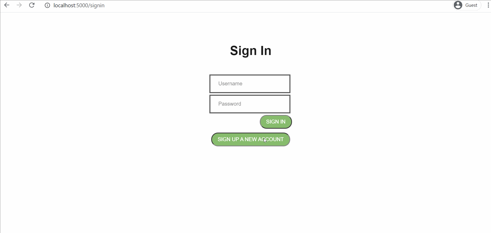

# Image Repository Challenge by Jackie Trang
Built an image repository that allows uploading images and deleting images using Flask framework and SQLite database.

## Features
1. Sign up new user
2. Log in existing user
3. Upload images, duplications are allowed
4. Delete images

## Project Structure
    README.md
    db_setup.py
    app.py
    requirements.txt
    Procfile
    templates
        |
        |----- index.html
        |----- signin.html
        |----- signup.html
    static
        |
        |----- uploads (folder to store images uploaded)
        |----- style.css
    tests
        |
        |----- unittests.py (tests with unittest)
        |----- test_features.py (test with pytest)

        
## How to run the app
### Windows 
1. Clone this repository to local computer
2. Set up virtual environment and install dependencies 
```sh
python -m venv .venv
source .venv/Scripts/activate
pip install -r requirements.txt
```
4. Go back to the directory because we're at activate file directory now
```sh
cd ../.. # go up two levels
```
3. Set up database (main directory)
```sh
python db_setup.py
```
4. Run the application
```sh
python app.py
```
The app will be running on ``` http://127.0.0.1:5000/ ``` in your web browser.

### MacOS
Step 1, 3, 4 are similar to Windows.
The only difference is in activating virtual environment (step 2):
```sh
python3.6 -m venv .venv
source .venv/bin/activate
pip3 install -r requirements.txt
```
## How to run unit test 
<strong>Note: </strong> Make sure the app is running when test files are executed. This can be done by having split terminals in IDE.
Go to `/tests` directory:
```sh
python unittests.py # test with unittest
python -m pytest test_features.py -v # test with pytest
```

## Project Demo
Here's a walkthrough of the app:
1. Sign up new user and log in existing user


2. Upload and delete images in that user's repository


GIF created with [LiceCap](http://www.cockos.com/licecap/).

## Deployment:
The application is running at: https://image-repo-app.herokuapp.com/


